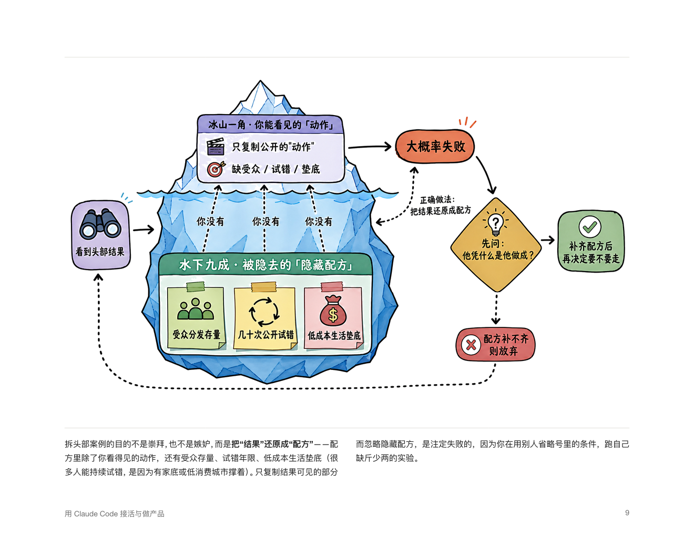

# book — 从零生成一本带设计感的 PDF 书

> An agent skill that turns a topic into a fully-designed, print-ready PDF **book** — researched outline, per-chapter writing, cover, table of contents, per-chapter illustrations, polished typesetting, and a fact-check pass. Works with any coding-agent environment (Claude Code, Codex, …).

把一个**主题**，经「广泛调研定目录 → 逐章并行写作 → 配封面与插画 → Typst 精排 → 事实核查与统稿」，做成一本**封面、目录、插画、排版俱全、可直接出片的 PDF 书**。

这是一个 **agent skill**：把它放进你的编码 agent 的 skills 目录，对它说「用 book skill 写一本《XX》」即可。它**与具体工具无关**——Claude Code、Codex 等都能用（用谁的子代理/并行机制都行，不支持并行就顺序做）。

---

## 效果示例 / Examples

> 以下为用本 skill 生成的一本示例书的真实页面。

| 封面 | 章节扉页（黑白连线插画 + 衬线大标题） |
|:--:|:--:|
|  |  |

**每章一张彩色手绘信息图**（手账 / sketchnote 风，纯白底，中文标签准确，各章不同）：

 

**排版正文页**（横版、双栏正文、跨页嵌入彩色信息图）：



---

## 它能产出什么

- 📕 **封面**：整版主色 + 衬线大标题（或调外部封面 skill 做精美封面）
- 📑 **自动目录**：从章节标题自动抓「标题 … 页码」
- 🎨 **每章一张主题插画**：白底、手绘、彩色 sketchnote 信息图（冰山 / 登山岔路 / 通关闸门 …），中文标签准确、各章不同
- 📐 **统一精排**：横版、衬线标题 + 无衬线正文、双栏正文、跨页代码/表/流程图
- ✅ **事实核查 + 统稿**：联网核实数字/版本/API、校验交叉引用、术语统一、外科手术式就地修正

## 工作流（6 阶段）

```
0 立项   → 和你对齐主题/读者/风格/是否插画
1 调研   → 多路并行调研一手来源 → 合成结构化目录(TOC)，给你过目
2 写章   → 每章一个子任务：写 Typst 正文 + 自编译自修复到零错误
3 配图   → 章节扉页走极简线条插画；封面/精美图走升级路径
4 拼装   → build_book.py 拼出 book.typ → typst 编译 → 逐页抽查
5 核查   → 事实核查 + 统稿，多轮重编
```

详见 `references/pipeline.md`。

## 内文图三条路（都嵌成 `#diagram("name")`）

| 路线 | 何时用 | 怎么实现 |
|---|---|---|
| `#flow(...)` | 线性三五步 | template 自带，极简 |
| **Mermaid** | 精确技术流程/状态机 | `mmdc` 渲染成 PNG |
| **插画信息图** | 要有趣/精致/比喻感（面向人的书首选） | 图像生成能力（如 `codex`）生成手绘彩色 sketchnote |

详见 `references/diagrams.md`、`styles/<style>/infographic-prompt.md`。

## 安装

```bash
# 1) 放进你的 agent 的 skills 目录（Claude Code 为例）
git clone https://github.com/songhuichen7-jpg/book_skill ~/.claude/skills/book

# 2) （可选，仅用 Mermaid 功能图时）装 mermaid-cli
cd ~/.claude/skills/book/tools && npm install @mermaid-js/mermaid-cli
```

然后在 agent 里：**「用 book skill 写一本《主题》」**。

## 依赖

- **`typst`** — 排版编译（必需）。`brew install typst`
- **图像生成能力** — 章节插画/封面用。skill 默认调 `codex` CLI（`codex exec`），也可换任意可用的图像生成 CLI/能力
- **`mmdc`**（mermaid-cli，可选）— 仅当用 Mermaid 功能图时；`cd tools && npm install`（会带一个 chromium）
- 字体 — `anthropic` 风格默认用常见系统衬线/无衬线字体；缺字就在 `styles/anthropic/template.typ` 顶部换等价字体

## 目录结构

```
book/
├── SKILL.md                 # 入口：何时用、流程速查、配图决策
├── references/
│   ├── pipeline.md          # 6 阶段流水线（主干，必读）
│   ├── template-api.md      # 每章正文的写作契约 + 可用组件
│   ├── illustrations.md     # 扉页插画：生图 → 色键抠透明
│   └── diagrams.md          # 内文图三条路（flow / Mermaid / 插画信息图）
├── scripts/
│   ├── build_book.py        # 从 toc.json 拼出 book.typ
│   ├── gen_illustrations.py # 逐章生图 + 抠透明（扉页线条插画）
│   ├── gen_infographics.py  # 逐张生成彩色插画信息图（自动漂白底 + 失败重试）
│   ├── render_mermaid.py    # Mermaid → PNG
│   └── chroma_key.py        # 色键抠透明工具
├── styles/
│   ├── README.md            # 风格契约 + 如何加新风格
│   └── anthropic/           # 内置风格：暖纸纯白 + 单一赤陶橙 + 衬线/无衬线
│       ├── template.typ     # 风格契约的 Typst 实现（导出全部组件）
│       ├── style.md
│       ├── illustration-prompt.md   # 扉页线条插画 art-direction
│       ├── infographic-prompt.md    # 彩色插画信息图 art-direction
│       ├── mermaid-template.mmd / mermaid.css
└── tools/                   # mermaid-cli（不入库，自行 npm install）
```

## 可插拔风格

每本书选一个**风格**（`styles/<name>/`），决定全部视觉与排版口味。内置 `anthropic`。加新风格只需照 `styles/README.md` 的**组件契约**新建一套 `template.typ + style.md + illustration-prompt.md`，正文/流水线/脚本一字不用改。

## 设计取舍 / 经验（写进了各 reference）

- **诚实**：内容是「调研 + 模型知识」生成，**付印前请人工通读**；事实尽量带一手来源；闭源系统内部细节用「据社区逆向/分析」措辞。
- **图的两个坑**：① 生图模型常给近白底，挨着白页显灰 → 脚本内置 `whiten()` 强制纯白；② 复杂长 prompt 会让生图超时/不出图 → prompt 精简 + 失败自动重试 + 只取本次新增图。
- **手绘要主动逼出彩色**：手账涂鸦默认偏黑白，风格前缀里要明确「彩色平涂、每张 ≥4 色、不同分区不同色」。

## 致谢

- 排版 [Typst](https://typst.app)、图表 [mermaid-cli](https://github.com/mermaid-js/mermaid-cli)。
- 插画风格为本 skill 原创（手绘彩色 sketchnote + 自有调色板），创作时浏览过社区里的手绘插画 skill 以理解「有趣」的方向，但风格、配色与实现均自成一套。

## License

MIT
